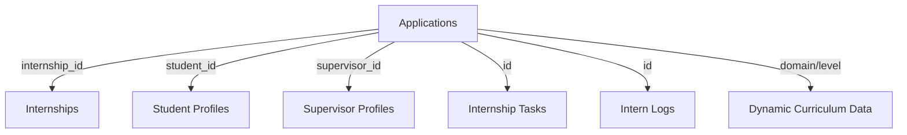

# 🚀 Zigex Intern Workspace - Developer Onboarding Guide

Welcome to the Zigex Core Team. This document serves as the definitive technical guide for the **Intern Workspace**, our flagship feature for managing the student internship experience.

---

## 🏗️ 1. High-Level Architecture
The Intern Workspace is built using the **Next.js 14+ App Router** and follows a Server-Client component split to balance SEO/Initial-Load with interactivity.

### Logic Flow:
1.  **Server Entry** (`app/(dashboard)/intern/workspace/page.tsx`): 
    - Authenticates the user.
    - Fetches the unified dashboard data via `getInternshipWorkspaceData()`.
    - Handles "Not Found" states (e.g., no active internship).
2.  **Client Orchestrator** (`components/sections/intern/InternWorkspaceClient.tsx`):
    - Receives the data object.
    - Manages UI tabs (Overview, Tasks, Curriculum, Network, Logs).
    - Stores global UI state (which tab is active, modal visibility).

---

## 📂 2. Core File & Folder Breakdown

### 📍 Route Level
- `app/(dashboard)/intern/workspace/page.tsx`: The primary route. It performs the heavy lifting for data fetching from Supabase using Server Actions.

### 📍 Feature Domain (`components/sections/intern/`)
This is where 90% of your work will happen.
- `InternWorkspaceClient.tsx`: The "Brain". It contains the Tab system and renders the appropriate sub-section.
- `DailyReportModal.tsx`: Interactive form for interns to submit their daily learning logs.
- `InternActivityGraph.tsx`: Visual representation of attendance and submission consistency.
- `InternAnnouncementBoard.tsx`: Real-time news and updates targeted at the intern's department.
- `LogbookPreviewModal.tsx`: Refined UI for viewing previous logs.

### 📍 Data Layer (`lib/`)
- `lib/actions/intenship.actions.ts`: Contains the `getInternshipWorkspaceData` function. It joins multiple tables: `Applications`, `internship_tasks`, `announcements`, `supervisor_profiles`, and `student_profiles`.
- `lib/data/intern-curriculum.ts`: A mission-critical file. It maps every internship **Domain** (e.g., "Web Development") and **Experience Level** to a specific, detailed technical curriculum.

---

## 📊 3. Data Interconnection
The workspace relies on a multi-table relationship in Supabase:

- **Identification**: We use the `application_id` as the primary key for most workspace features.
- **Dynamic Content**: When `InternWorkspaceClient` renders the Curriculum tab, it checks the `application.domain` and `application.level` of the user and queries the `lib/data/intern-curriculum.ts` file to generate the roadmap instantly.

---

## 🧪 4. Developer Protocols

### Working on the UI
- **Styling**: Use Tailwind CSS properties. Avoid custom CSS unless absolutely necessary.
- **Icons**: Always use `lucide-react` icons. Maintain the consistent size (`size={18}` or `{20}`).
- **Colors**: Use the Zigex Palette. Primary blue: `#155DFC`. Backgrounds: `#F6F8FF` (light) or Slate-900 (dark).

### Interacting with State
- Use **React State** locally within components for UI toggles (modals, dropdowns).
- Use **Server Actions** for data mutations (submitting a task, checking in).

### Syncing with the Team
Before starting any feature, ensure you are building on the latest refactor:
1. `git checkout dashboard-refactor`
2. `git pull origin dashboard-refactor`
3. `git checkout -b task/feature-name`

---

## 🚩 5. Current Focus: "Live" Performance
To keep the workspace feeling "live":
- **Optimistic UI**: When a student checks in, update the UI immediately before the database confirms.
- **SSR Optimization**: The `page.tsx` fetches everything in parallel to ensure the "LCP" (Largest Contentful Paint) is under 1.5 seconds.
- **Local Curriculum**: We do NOT fetch curriculum from the DB yet. It's stored in `lib/data/` for maximum speed.

---

### Need Help?
Contact the Technical Lead or check the [BACKLOG_TASKS.md](file:///c:/Users/THE%20EYE%20INFORMATIQUE/OneDrive/Desktop/All/Zigex/zApp/BACKLOG_TASKS.md) for your specific assignments.
