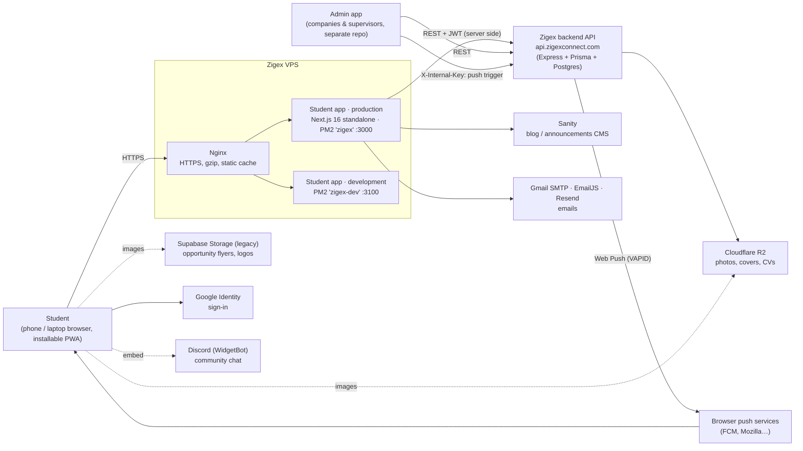
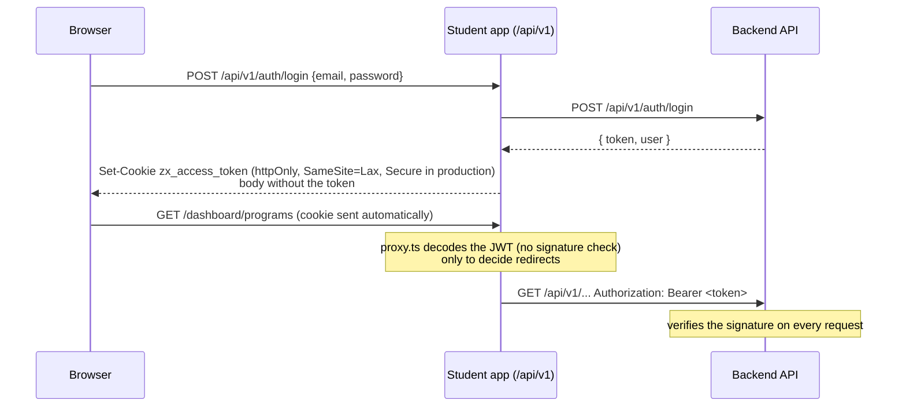
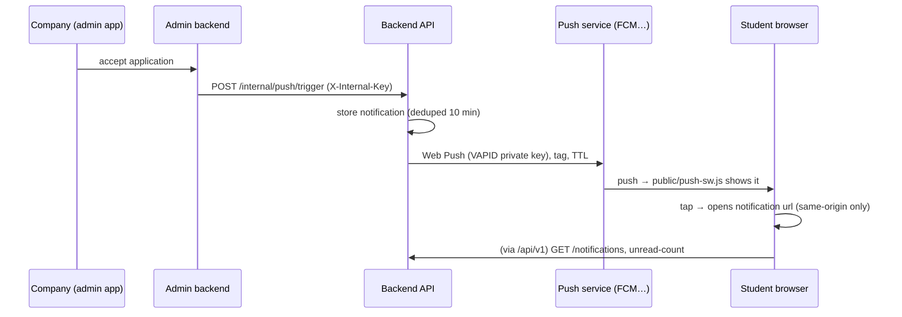
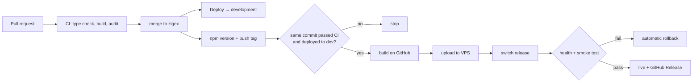

# System architecture

How the Zigex student app fits together: what talks to what, how a request travels, and where data and secrets live. Read this before changing anything that crosses a boundary (auth, data fetching, uploads, notifications, deploys).

**Last reviewed:** 8 October 2026 (v1.0.0). Update it when a boundary changes, in the same pull request.

---

## 1. The big picture



| Part | What it is | Owned by |
| --- | --- | --- |
| **Student app** (this repo) | Next.js 16 (App Router, React 19, Tailwind v4). Renders every page, keeps the session cookie, forwards API calls. **No database of its own.** | Frontend team |
| **Backend API** | `https://api.zigexconnect.com`, Swagger at `/api-docs`. All data: students, opportunities, applications, notifications, uploads, push. | Backend team |
| **Admin app** | Separate repo (`zigex-admin`). Companies post opportunities and review applications; supervisors manage interns. Talks to the same backend. | Frontend team |
| **Cloudflare R2** | File storage behind the backend. Public files (avatars, covers) by URL; private files (CVs) through signed URLs. | Backend team |
| **Supabase Storage** | Legacy storage still holding older opportunity images and company logos. Read-only from this app. | Legacy |
| **Sanity** | CMS for announcements/blog. Studio at `/studio`. | Content team |
| **Email** | Gmail (Nodemailer) for application emails, EmailJS for the welcome email and waitlists, Resend for the contact form. See [setup/email.md](./setup/email.md). | Frontend team |

## 2. Inside the student app

```text
Browser
  │  pages (HTML + React Server Components)          fetch("/api/v1/…")  (client components)
  ▼                                                    │
proxy.ts  ── who may see this page? (reads the session cookie, redirects) │
  ▼                                                    ▼
Server Components / Server Actions            app/api/v1/[...path]  (passthrough)
  │  lib/api/services/*  (domain logic)               │  adds  Authorization: Bearer <JWT from cookie>
  │  lib/api/server-client.ts  (serverApi)            │  stores the token on sign-in, clears it on sign-out
  └──────────────► Backend API ◄──────────────────────┘
```

**Layers** (top calls bottom, never the other way):

| Layer | Where | Rule |
| --- | --- | --- |
| Pages and layouts | `app/**/page.tsx`, `layout.tsx`, `loading.tsx`, `error.tsx` | Fetch through services; keep markup in components |
| Components | `components/<feature>/…` | Presentational or interactive; client components call `lib/api/*-client.ts` |
| Services (server) | `lib/api/services/*.ts` | One file per domain (feed, applications, profile, programs…). Server-only (`import "server-only"`) |
| Browser clients | `lib/api/*-client.ts` | The same domains for client components, through `/api/v1` |
| Shapes | `lib/api/*-shape.ts` | Turn backend responses into what the UI expects. **The only place that knows the backend's field-name quirks.** |
| HTTP | `lib/api/server-client.ts`, `lib/api/browser-client.ts`, `lib/api/errors.ts` | Timeouts, `ApiClientError`, `whenAvailable()` for endpoints that may not exist yet |

**Route groups** (folders in parentheses don't appear in URLs):

| Group | Pages | Access |
| --- | --- | --- |
| `(main)` | landing `/`, `/privacy` | Public; signed-in students are sent to `/feed` |
| `(public)` | `/feed`, `/feed/[id]`, `/company/[id]` | Public, shareable |
| `(auth)` | sign-in, sign-up, verify-email, forgot/reset/update password | Public; signed-in students are sent on |
| `(onboarding)` | `/create-profile`, `/profile-complete` | Signed in |
| `(dashboard)` | Programs, My applications, Announcements, Students, profiles, Communities, Notifications, Settings, Edit profile, Zila, intern workspace | Signed in; shared shell (sidebar, header, mobile tab bar) |
| other | `/studio` (Sanity), `/attendance/scan`, `/offline` (PWA fallback), `/projects` | Mixed |

Legacy pages still in the tree, not linked from the main navigation: `/dashboard/job-stores`, `/dashboard/viewpage`, `/dashboard/track-progress`, `/dashboard/company`, `/dashboard/projects`, `/demo`, `/internships`, `/events`. Candidates for removal.

## 3. Sign-in and sessions



- **The token never reaches JavaScript.** It lives in the httpOnly cookie `zx_access_token`; the passthrough (`app/api/v1/[...path]/route.ts`) adds it as a Bearer header. Token-issuing paths: `auth/login`, `auth/verify-email`, `auth/reset-password`, `auth/google`.
- **`proxy.ts` is for routing, not security.** It reads the JWT payload without verifying it (`lib/api/jwt.ts`) to redirect signed-out visitors to `/sign-in?next=…` and non-students to the admin app. The backend verifies every data request, so a forged cookie only gets 401s.
- **Return after sign-in:** `?next=` is checked by `lib/utils/redirect.ts` (relative paths on an allow-list; no `//`, backslashes or protocols).
- **Google sign-in:** Google Identity Services gives an ID token; `POST /auth/google` exchanges it for our JWT. Our styled button has Google's real button invisibly scaled over it (`components/sections/auth/GoogleSignInButton.tsx`).
- **Roles:** the app is for `student`. Company/supervisor accounts are redirected to the admin app (`NEXT_PUBLIC_ADMIN_APP_URL`).

## 4. Getting data fast

The backend answers in 0.5–1.5 s, so the app avoids calls rather than waiting for them.

| Technique | Where | Effect |
| --- | --- | --- |
| **Per-request dedupe** with React `cache()` | `getMyProfile`, `fetchMyApplicationRows`, `getFeedItemById` | One `/students/me` and one `/applications` per page, however many components need them |
| **Shared public cache** (`fetch` with `next: { revalidate: 120 }`, no token) | `listPublicFeed`, `getPublicFeedItem`, `latestFeed` | Explore lists, opportunity details and "more from this company" are cached 2 minutes for everyone |
| **Parallel fetches** | `Promise.all` in pages (e.g. opportunity page: prefill + status) | No waterfalls |
| **Streaming** | `loading.tsx` per page (page-shaped skeletons), `<Suspense>` around secondary sections | The page appears before slow parts finish |
| **Image optimisation** | `components/CoverImage.tsx` → `next/image` for allowed hosts | A 394 KB flyer becomes a 44 KB WebP on phones |
| **Fewer background calls** | Notification bell polls every 60 s only while the tab is visible; push subscription re-synced once a day | Less load on the backend |

Signed-in data is always `cache: "no-store"` (it's personal). Only public, token-free data is shared-cached.

## 5. Uploads

```text
Pick photo → crop dialog (1080 px square) → resize/re-encode in the browser (JPEG, ~150–400 KB)
  → base64 JSON → POST /api/v1/uploads/avatar (passthrough, 60 s timeout) → backend → R2
  → returns the public URL → PATCH /students/me { avatarUrl } → page refresh
```

- Resizing happens before upload (`lib/api/uploads.ts`): avatars 1080 px, covers 2400 px. CVs (PDF/.doc, 5 MB) go to `/uploads/resume/{applicationId}` after the application exists.
- Every displayed image goes through `usableImageUrl()` (`lib/images.ts`), which hides known-bad hosts and, **temporarily**, rewrites `files.zigexconnect.com` to the bucket's `r2.dev` address until that domain has DNS. `SafeImg` hides broken images so initials show instead.

## 6. Notifications and push



- Students turn push on in **Settings** (never prompted on page load). The app subscribes with `NEXT_PUBLIC_VAPID_PUBLIC_KEY` and sends the subscription to `POST /push/subscriptions`. An old-key subscription is replaced automatically (`lib/push-keys.ts`).
- The bell and `/notifications` use `notificationHref()` (`lib/notifications.ts`): the backend's `url` when it's a local path, otherwise a link worked out from the type. Duplicates are merged.
- Event list, wording and links: [backend/notifications.md](./backend/notifications.md).

## 7. Errors

| Situation | What the student sees | Where |
| --- | --- | --- |
| A page can't load (slow/failed backend) | "This page didn't load" + Try again (refetches) + reference code; offline variant retries when back online | `app/error.tsx`, `app/(dashboard)/error.tsx`, `app/global-error.tsx` → `components/errors/ErrorScreen.tsx` |
| An action fails (apply, upload, delete) | Specific message next to the button (offline / slow / signed out / closed / try again) | e.g. `components/apply/ApplyDialog.tsx` |
| An endpoint isn't deployed yet | An empty or "coming soon" state, not an error | `whenAvailable()` / `isEndpointMissing()` in `lib/api/errors.ts` |
| Missing page | `app/not-found.tsx` | |

Catch blocks that log errors call `unstable_rethrow(error)` first so Next.js's own signals (redirects, "render per request") pass through.

## 8. Environments and deployment

| | Development | Production |
| --- | --- | --- |
| URL | `dev.zigexconnect.com` | `zigexconnect.com` |
| Deployed from | every push to `zigex` | version tags `vX.Y.Z` |
| On the VPS | `/var/www/zigex-dev`, PM2 `zigex-dev`, :3100 | `/var/www/zigex`, PM2 `zigex`, :3000 |
| Indexing | blocked (`NEXT_PUBLIC_APP_ENV=development`) | allowed |
| Backend | same API (real data) | same API |



Build output is Next.js **standalone** (`server.js` + traced `node_modules`); releases are folders `releases/<version>_<timestamp>` with a `current` symlink, so rollback is a symlink switch. Details: [setup/deploy.md](./setup/deploy.md).

## 9. Configuration and secrets

- **Build-time, public:** `NEXT_PUBLIC_*` values are baked into the browser bundle. Set in GitHub Variables (per environment). Never put a secret behind `NEXT_PUBLIC_`.
- **Runtime, private:** everything else (`JWT_SECRET`, `GMAIL_*`, `EMAILJS_PRIVATE_KEY`, `RESEND_API_KEY`, `SANITY_WEBHOOK_SECRET`…) lives only in each site's `shared/.env` on the VPS, loaded by Node's `--env-file`.
- **Shared with other systems:** `JWT_SECRET` must match the admin app (attendance QR codes are signed there and checked here). The VAPID public key must match the backend's pair.
- Full list with meanings: `.env.example` and [README](../README.md).

## 10. Security notes

- **Headers** (`proxy.ts`): `X-Frame-Options: SAMEORIGIN`, `X-Content-Type-Options: nosniff`, `Referrer-Policy`, `Permissions-Policy`. No CSP yet (candidate).
- **Open redirects:** `?next=` and notification links only accept local paths.
- **Push:** the service worker only opens same-origin URLs. The push trigger is backend-to-backend with a shared key.
- **Files:** CVs are private (signed URLs); uploads are size- and type-checked in the browser and by the backend.
- **The app trusts the backend for authorisation.** Never decide permissions in the frontend alone.

## 11. Known limitations and debt

- 51 TypeScript errors in older pages; type check is report-only in CI and `ignoreBuildErrors` is on.
- No automated tests yet (the smoke test checks pages after each deploy).
- Temporary workarounds: the `files.zigexconnect.com` rewrite (`lib/images.ts`) and stub-posting hydration (`lib/api/applications-shape.ts`).
- Security updates pending: `html2pdf.js` (critical), `nodemailer` (high).
- Development and production share one backend, so testing on dev uses real data.
- Open backend requests: [backend/open-requests.md](./backend/open-requests.md).
