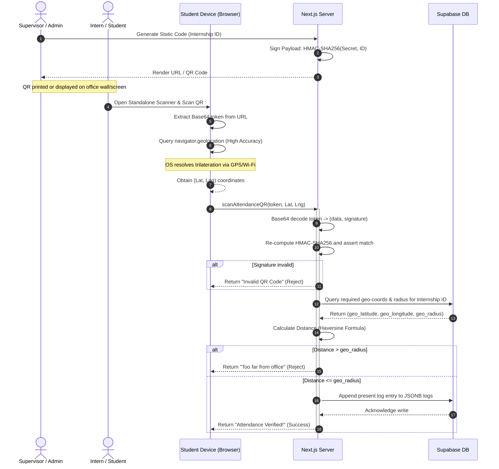
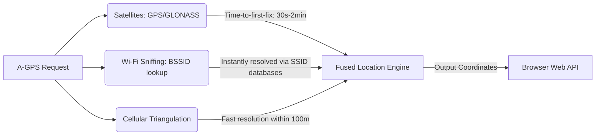

# Zigex Geolocation & QR Attendance System: Deep-Dive Mathematical & Architectural Specification

This document provides a rigorous mathematical and architectural breakdown of the Zigex Geolocation and QR-based Attendance verification system. Designed for engineering reference and learning, this deep-dive covers:
1. **System Architecture and Flow**
2. **Cryptographic Proof of Context (HMAC-SHA256)** and defense against Length Extension Attacks
3. **Map Geolocation and GPS Trilateration Math**
4. **Distance Verification Mathematics (Spherical Law of Cosines, Haversine, and Vincenty)**
5. **Numerical Stability, Coordinate Precision, and Hardware Constraints**
6. **Code Mapping to Implementation**

---

## 1. System Architecture & Flow

The system solves the **Distributed Location-Trust Problem**: *How does a central server securely verify that a physical client was present at a specific geo-location coordinate at a specific timestamp without trusting the client's self-reported coordinates or allowing attendance spoofing?*

We address this by combining **Proof of Context** (scanning a cryptographically signed, site-specific token) with **Proof of Presence** (validating device GPS coordinates against geofenced coordinates).

### System Component Architecture

```mermaid
graph TD
    subgraph Client [Client Device / Browser]
        UI[StandaloneQRScanner / Client UI] -->|1. Request Coordinates| GPS[OS Geolocation API]
        GPS -->|A-GPS / Cell / Wi-Fi Sniffing| Hardware[GPS Hardware Sensors]
        UI -->|2. Camera Stream| Camera[HTML5 QR Code Reader]
    end

    subgraph Server [Next.js Web Server]
        Actions[Server Actions: scanAttendanceQR]
        CryptoLib[Node.js crypto / HMAC Engine]
        DistanceCalc[Haversine Solver]
    end

    subgraph Database [Supabase Cloud]
        DB_Geo[Internships / Programs Table]
        DB_Logs[Attendance logs Table]
    end

    Camera -->|Decode static signed URL| UI
    UI -->|3. POST RPC (token, Lat, Lng)| Actions
    Actions -->|4. Verify Signature| CryptoLib
    Actions -->|5. Query Office Coordinates| DB_Geo
    Actions -->|6. Calculate Distance| DistanceCalc
    Actions -->|7. Write Entry (JSONB append)| DB_Logs
```

### End-to-End Sequence Flow



---

## 2. Cryptographic Proof of Context: HMAC-SHA256

To prevent students from generating fake QR codes or checking in for programs they aren't assigned to, the server signs all payloads using a **Hash-based Message Authentication Code (HMAC)** with **SHA-256** as the cryptographic hash function.

### The Merkle-Damgård Construction & Length Extension Attacks

Simple message authentication designs like \(S = H(K_{\text{secret}} \parallel M)\) are vulnerable to **Length Extension Attacks** if the hash function \(H\) utilizes the Merkle-Damgård construction (which MD5, SHA-1, and SHA-256 do).

In a Merkle-Damgård hash function, the input message is split into fixed-size blocks (e.g., 512 bits) after applying padding (which includes the message length). The hash function processes each block sequentially to update an internal state variable:

\[\mathbf{h}_{i} = f(\mathbf{h}_{i-1}, \mathbf{M}_i)\]

where \(\mathbf{h}_0\) is a constant initialization vector (IV), and \(\mathbf{h}_N\) is the final hash output.

```
       +-------+     +-------+     +-------+
IV --> |   f   | --> |   f   | --> |   f   | --> Hash Output (State h_N)
       +-------+     +-------+     +-------+
           ^             ^             ^
        Block 1       Block 2       Block 3
```

If an attacker intercepts a valid message \(M\) and its signature \(S = H(K_{\text{secret}} \parallel M)\), they know the final state of the hash function \(\mathbf{h}_N = S\). Even though they do not know \(K_{\text{secret}}\), they can:
1. Initialize the hash function's internal state with \(\mathbf{h}_N\).
2. Pad the original message \(M\) to simulate the block boundary.
3. Append a malicious extension \(M_{\text{adv}}\) (e.g., changing the internship ID or user permissions).
4. Run the compression function \(f\) on \(M_{\text{adv}}\) to obtain a new hash value \(S'\).

This new signature \(S'\) will be evaluated as valid for the extended message \(M \parallel \text{Padding} \parallel M_{\text{adv}}\) by any server verifying signatures using \(H(K_{\text{secret}} \parallel \text{payload})\).

### How HMAC Prevents Length Extension

HMAC resolves this by hashing the message twice with two derived keys (inner and outer keys), preventing an attacker from hijacking the internal state of the hash function.

\[\text{HMAC}(K, m) = H\Big( (K' \oplus \text{opad}) \parallel H\big( (K' \oplus \text{ipad}) \parallel m \big) \Big)\]

Where:
* \(H\) is the underlying cryptographic hash function (SHA-256).
* \(K\) is the secret key.
* \(K'\) is a key derived from \(K\) (if \(K\) is longer than the block size of \(H\), it is hashed first; if shorter, it is padded with zeros on the right to match the block size).
* \(\text{ipad}\) is the inner padding constant: the byte `0x36` repeated block-size times (64 times for SHA-256).
* \(\text{opad}\) is the outer padding constant: the byte `0x5C` repeated block-size times (64 times for SHA-256).
* \(\oplus\) denotes bitwise exclusive OR (XOR).
* \(\parallel\) denotes string concatenation.

Because the outer hash \(H\big((K' \oplus \text{opad}) \parallel \dots\big)\) wraps the inner hash, an attacker cannot perform a length extension attack on the inner hash because the result of the inner hash is never exposed in isolation, and they cannot extend the outer hash because they do not know the outer key \((K' \oplus \text{opad})\).

### Payload & Token Serialization Lifecycle

In the Zigex implementation, the token generation and validation lifecycle operates as follows:

#### Step A: Serialization of Metadata
The supervisor generates a JSON payload representing the context:
```json
{
  "internshipId": "4a6e3d9b-2c1f-4903-b8e7-e2c7f8a9a1b0",
  "type": "zigex_attendance_v2",
  "createdBy": "8b7e2d1f-8891-4c12-a7f4-8a71d0e12345",
  "createdAt": "2026-06-30T12:00:00.000Z"
}
```
Let \(D\) represent this serialized JSON string.

#### Step B: Signature Generation
Using the server's private environment variable `SECRET_KEY`, the server calculates the signature:
\[\text{sig} = \text{HMAC-SHA256}(K_{\text{secret}}, D)\]

#### Step C: Envelope Packing & Base64 Encoding
The payload and signature are packaged into a wrapper object and encoded to Base64 to make it URL-safe:
\[\text{envelope} = \text{JSON.stringify}(\{ d: D, s: \text{sig} \})\]
\[\text{token} = \text{Base64Encode}(\text{envelope})\]

The final static URL becomes:
`https://zigexconnect.com/attendance/scan?token=eyJkIjp7ImludGVybnNoaXBJZCI6IjRhNmUzZDliLTJjMWYtNDkwMy1iOGU3LWUyYzdmOGE5YTFiMCIsInR5cGUiOiJ6aWdleF9hdHRlbmRhbmNlX3YyIiwiY3JlYXRlZEJ5IjoiOGI3ZTJkMWYtODg5MS00YzEyLWE3ZjQtOGE3MWQwZTEyMzQ1IiwiY3JlYXRlZEF0IjoiMjAyNi0wNi0zMFQxMjowMDowMC4wMDBaIn0sInMiOiI4ZjllMzBiNmY5YzcyN2E2Z..."`

#### Step D: Verification
When the student scans the QR code, the server decodes the Base64 token back to the envelope, extracts \(\{ d, s \}\), and verifies:
\[\text{HMAC-SHA256}(K_{\text{secret}}, d) \stackrel{?}{=} s\]

---

## 3. Physical Proof of Presence: Trilateration & GPS Math

Once the cryptographic context is validated, the server must verify the physical presence of the client. 

### How GPS Solves 3D Trilateration

To obtain the coordinates \((lat, lng)\) sent to the server, the student's mobile device must solve a 3D trilateration problem using signals from the Global Positioning System (GPS).

Let \((x_i, y_i, z_i)\) represent the coordinates of satellite \(i\) at the time of signal transmission, and let \(t_i\) be the time the signal was transmitted.
Let \((x, y, z)\) be the unknown receiver position, and \(t_u\) be the unknown receiver clock time.
The time of arrival at the receiver is \(t_{\text{rec}, i}\). The propagation delay is:
\[\Delta t_i = t_{\text{rec}, i} - t_i\]

Because the receiver's clock is not perfectly synchronized with the atomic clocks of the satellites, there is a clock bias \(t_b\) (measured in seconds). The actual distance (pseudorange \(P_i\)) is calculated as:
\[P_i = c \cdot \Delta t_i = d_i + c \cdot t_b\]
where \(c\) is the speed of light (\(299,792,458 \text{ m/s}\)), and \(d_i\) is the true geometric distance:
\[d_i = \sqrt{(x - x_i)^2 + (y - y_i)^2 + (z - z_i)^2}\]

This gives a system of nonlinear equations for each satellite \(i\):
\[(x - x_i)^2 + (y - y_i)^2 + (z - z_i)^2 = (P_i - c \cdot t_b)^2\]

Because we have 4 unknowns \((x, y, z, t_b)\), we require observations from at least \(N \ge 4\) satellites.

```
                   Satellite 1 (x1, y1, z1)
                       o
                      / \
                     /   \  d1
                    /     \
    Satellite 2    /       \       Satellite 3 (x3, y3, z3)
   (x2, y2, z2) o-/---------\-o
                 \           /
                  \  (x,y,z)/
                   \   o   /  d3
                 d2 \  |  /
                     \ | /
                       o
                   Satellite 4 (x4, y4, z4)
```

#### Linearizing the Spherical Intersections
To solve this system computationally on a chip, we can linearize the equations by selecting one satellite (e.g., satellite 1) as a reference and subtracting its equation from the remaining satellite equations (\(i = 2, 3, \dots, N\)).

Let:
\[R_i^2 = x_i^2 + y_i^2 + z_i^2\]

The equation for any satellite \(i\) is:
\[x^2 - 2xx_i + x_i^2 + y^2 - 2yy_i + y_i^2 + z^2 - 2zz_i + z_i^2 = (P_i - c t_b)^2\]
\[x^2 + y^2 + z^2 - 2(xx_i + yy_i + zz_i) + R_i^2 = P_i^2 - 2P_i c t_b + c^2 t_b^2\]

Subtracting the reference equation for satellite 1 (\(i=1\)) from the equation for satellite \(i\) yields:
\[-2x(x_i - x_1) - 2y(y_i - y_1) - 2z(z_i - z_1) + R_i^2 - R_1^2 = (P_i^2 - P_1^2) - 2c t_b(P_i - P_1)\]

Rearranging terms into a system of linear equations of the form \(\mathbf{A}\mathbf{x} = \mathbf{b}\):
\[2x(x_i - x_1) + 2y(y_i - y_1) + 2z(z_i - z_1) - 2c(P_i - P_1)t_b = (P_1^2 - P_i^2) + (R_i^2 - R_1^2)\]

For \(N \ge 4\) satellites, this forms a matrix equation:
\[\begin{bmatrix} 
2(x_2 - x_1) & 2(y_2 - y_1) & 2(z_2 - z_1) & -2c(P_2 - P_1) \\
2(x_3 - x_1) & 2(y_3 - y_1) & 2(z_3 - z_1) & -2c(P_3 - P_1) \\
\vdots & \vdots & \vdots & \vdots \\
2(x_N - x_1) & 2(y_N - y_1) & 2(z_N - z_1) & -2c(P_N - P_1)
\end{bmatrix}
\begin{bmatrix}
x \\ y \\ z \\ t_b
\end{bmatrix}
=
\begin{bmatrix}
(P_1^2 - P_2^2) + (R_2^2 - R_1^2) \\
(P_1^2 - P_3^2) + (R_3^2 - R_1^2) \\
\vdots \\
(P_1^2 - P_N^2) + (R_N^2 - R_1^2)
\end{bmatrix}\]

Using the pseudoinverse (Least Squares method) for \(N > 4\):
\[\mathbf{x} = (\mathbf{A}^T\mathbf{A})^{-1}\mathbf{A}^T\mathbf{b}\]

This outputs the 3D Cartesian coordinates \((x,y,z)\) in the WGS-84 coordinate system, which the device's operating system converts to Geodetic coordinates (Latitude \(\phi\), Longitude \(\lambda\), and Ellipsoidal Height \(h\)) using Bowring's method or closed-form geodetic conversion algorithms.

---

## 4. Distance Verification Mathematics

Once the student's device yields \((\phi_1, \lambda_1)\) and transmits them to the server, the server action checks the distance against the target coordinates \((\phi_2, \lambda_2)\) stored in Supabase.

### Derivation of the Haversine Formula

For points separated by relatively small distances (e.g., less than 50 km) on a sphere of radius \(R\), we calculate the central angle \(\theta\) between the two coordinates. The Haversine formula is derived from the **Spherical Law of Cosines**:

\[\cos(\theta) = \sin(\phi_1)\sin(\phi_2) + \cos(\phi_1)\cos(\phi_2)\cos(\Delta \lambda)\]

where:
* \(\phi_1, \phi_2\) are the latitudes of point 1 and 2 in radians.
* \(\lambda_1, \lambda_2\) are the longitudes in radians.
* \(\Delta \lambda = \lambda_2 - \lambda_1\).

#### The Catastrophic Cancellation Problem
If we use the Spherical Law of Cosines directly to compute \(\theta = \arccos(\dots)\), a major numerical issue occurs on computers. When the distance is very small (e.g., a student checking in 20 meters from an office), the central angle \(\theta\) is close to 0. 

Consequently, the value inside the arccos:
\[\sin(\phi_1)\sin(\phi_2) + \cos(\phi_1)\cos(\phi_2)\cos(\Delta \lambda) \approx 0.99999999999999\]

Double-precision floating-point numbers (IEEE 754) only provide 53 bits of mantissa precision (roughly 15 to 17 decimal digits). Evaluating \(1 - \cos(\theta)\) in this regime results in **catastrophic cancellation**—the subtraction of two nearly equal numbers destroys the lowest-order bits of precision. The \(\arccos(x)\) function also becomes highly sensitive to tiny precision errors when \(x \approx 1\), because the derivative \(\frac{d}{dx}\arccos(x) = -\frac{1}{\sqrt{1-x^2}}\) approaches infinity as \(x \to 1\).

#### Resolving via Haversines
To solve this, we rewrite the equation using the **haversine function** definition:
\[\operatorname{hav}(\theta) = \sin^2\left(\frac{\theta}{2}\right) = \frac{1 - \cos(\theta)}{2}\]

Substitute the cosine double-angle identity \(\cos(\Delta \lambda) = 1 - 2\sin^2\left(\frac{\Delta \lambda}{2}\right)\) into the Spherical Law of Cosines:
\[\cos(\theta) = \sin(\phi_1)\sin(\phi_2) + \cos(\phi_1)\cos(\phi_2)\left(1 - 2\sin^2\left(\frac{\Delta \lambda}{2}\right)\right)\]
\[\cos(\theta) = \big[\sin(\phi_1)\sin(\phi_2) + \cos(\phi_1)\cos(\phi_2)\big] - 2\cos(\phi_1)\cos(\phi_2)\sin^2\left(\frac{\Delta \lambda}{2}\right)\]

Using the cosine difference identity \(\cos(A-B) = \cos(A)\cos(B) + \sin(A)\sin(B)\):
\[\cos(\theta) = \cos(\phi_1 - \phi_2) - 2\cos(\phi_1)\cos(\phi_2)\sin^2\left(\frac{\Delta \lambda}{2}\right)\]

Substitute \(\cos(\theta) = 1 - 2\operatorname{hav}(\theta)\) and \(\cos(\phi_1 - \phi_2) = 1 - 2\operatorname{hav}(\phi_1 - \phi_2)\):
\[1 - 2\operatorname{hav}(\theta) = 1 - 2\operatorname{hav}(\phi_1 - \phi_2) - 2\cos(\phi_1)\cos(\phi_2)\sin^2\left(\frac{\Delta \lambda}{2}\right)\]

Subtract 1 from both sides and divide by \(-2\):
\[\operatorname{hav}(\theta) = \operatorname{hav}(\phi_1 - \phi_2) + \cos(\phi_1)\cos(\phi_2)\sin^2\left(\frac{\Delta \lambda}{2}\right)\]
\[\sin^2\left(\frac{\theta}{2}\right) = \sin^2\left(\frac{\phi_1 - \phi_2}{2}\right) + \cos(\phi_1)\cos(\phi_2)\sin^2\left(\frac{\Delta \lambda}{2}\right)\]

Let \(a = \sin^2\left(\frac{\theta}{2}\right)\). Thus:
\[a = \sin^2\left(\frac{\Delta \phi}{2}\right) + \cos(\phi_1)\cos(\phi_2)\sin^2\left(\frac{\Delta \lambda}{2}\right)\]

From this, the central angle \(\theta\) is:
\[\theta = 2 \arcsin(\sqrt{a})\]

To improve numerical stability on computing architectures, we express this using the two-argument arctangent function (\(\operatorname{atan2}\)), which computes \(\arctan(y/x)\) while preserving quadrant sign and avoiding division-by-zero limits:
\[\theta = 2 \cdot \operatorname{atan2}\left(\sqrt{a}, \sqrt{1-a}\right)\]

The final geodesic distance \(d\) along the sphere is:
\[d = R \cdot \theta = 2R \cdot \operatorname{atan2}\left(\sqrt{a}, \sqrt{1-a}\right)\]

---

### Earth Ellipsoid Models: WGS-84 & Vincenty's Formulae

The Haversine formula assumes the Earth is a perfect sphere with a mean radius \(R \approx 6,371 \text{ km}\). However, the Earth is an oblate spheroid, flattened at the poles due to centrifugal forces from rotation.

```
                  Polar Semi-minor axis (b ≈ 6356.752 km)
                             ^
                             |
             +---------------+---------------+
            /|               |               |\
           / |               |               | \
          /  |               |               |  \
---------+---+---------------+---------------+---+--> Equator
          \  |               |               |  /
           \ |               |               | /
            \|               |               |/
             +---------------+---------------+
                             |
                             v
               Equatorial Semi-major axis (a ≈ 6378.137 km)
```

The standard reference ellipsoid is **WGS-84**, defined by:
* Semi-major axis (equatorial radius) \(a = 6,378,137.0 \text{ m}\)
* Semi-minor axis (polar radius) \(b \approx 6,356,752.314245 \text{ m}\)
* Flattening \(f = \frac{a - b}{a} = \frac{1}{298.257223563}\)

To compute geodesic distances on this ellipsoid with millimeter accuracy, one must use **Vincenty's Formulae**, which iteratively solve for the geodesic path using elliptic integrals.

#### Comparison of Geodesic Distance Computations

| Metric | Haversine Formula | Vincenty's Formulae |
| :--- | :--- | :--- |
| **Mathematical Basis** | Spherical geometry (Sphere) | Geodesics on an oblate spheroid (Ellipsoid) |
| **Accuracy** | \(\le 0.5\%\) error globally | \(\le 0.5 \text{ mm}\) error |
| **Iterative?** | No (Closed-form, single-pass) | Yes (Iterative convergence needed, can fail to converge for nearly antipodal points) |
| **Computational Cost** | Low (\(\approx 7\) trigonometric operations) | High (Requires iterative loop, \(15+\) trig ops per iteration) |
| **Suitability for Zigex** | **Ideal**. A 0.5% error on a 100m geofence is 50cm, which is negligible compared to standard GPS hardware noise (3-10m). | Overkill for micro-geofencing; computationally heavy for high-concurrency server actions. |

---

## 5. Precision Limits & Hardware Constraints

### Coordinate Representation & Floating-Point Limits

When coordinates are represented as double-precision floating-point numbers (IEEE 754), they occupy 64 bits:
* 1 sign bit
* 11 exponent bits
* 52 fraction bits (53 bits of significand precision)

This provides roughly \(15.9\) decimal digits of precision. Let's look at the physical distance corresponding to changes in the decimal places of Latitude/Longitude coordinates:

\[\Delta \text{Latitude } 1^\circ \approx 111.32 \text{ km} = 111,320 \text{ m}\]
\[\Delta \text{Longitude } 1^\circ \approx 111.32 \text{ km} \cdot \cos(\phi)\]

At the equator \((\phi = 0^\circ)\), the resolution scales as follows:

| Decimal Places | Format (e.g. at lat=\(5.0^\circ\)) | Precision in Degrees | Approximate Physical Resolution | Typical Device Source |
| :--- | :--- | :--- | :--- | :--- |
| **0** | \(5^\circ\) | \(1.0^\circ\) | \(111.32 \text{ km}\) | Country-level IP Lookup |
| **1** | \(5.9^\circ\) | \(0.1^\circ\) | \(11.13 \text{ km}\) | Large City-level |
| **2** | \(5.96^\circ\) | \(0.01^\circ\) | \(1.11 \text{ km}\) | Suburb / Wi-Fi ISP |
| **3** | \(5.963^\circ\) | \(0.001^\circ\) | \(111.3 \text{ m}\) | Cell Tower Triangulation |
| **4** | \(5.9631^\circ\) | \(0.0001^\circ\) | \(11.13 \text{ m}\) | IP/Cellular hybrid |
| **5** | \(5.96312^\circ\) | \(0.00001^\circ\) | \(1.11 \text{ m}\) | **A-GPS (Standard Phone GPS)** |
| **6** | \(5.963120^\circ\) | \(0.000001^\circ\) | \(11.1 \text{ cm}\) | Survey-grade Differential GPS |
| **7** | \(5.9631201^\circ\) | \(0.0000001^\circ\) | \(1.11 \text{ cm}\) | Precision mapping |

Since the typical GPS accuracy of consumer-grade mobile devices is \(3\) to \(8\) meters, storing coordinate fields beyond 5 or 6 decimal places yields no functional improvement, as the sensor noise exceeds the resolution limit.

### A-GPS: How Browsers Resolve Coordinates

When calling `navigator.geolocation.getCurrentPosition()`, the client browser queries the host OS location services. The OS integrates multiple sources in a process called **Assisted GPS (A-GPS)**:



To optimize the balance between speed, power, and precision, the client-side code configuration is critical:

```typescript
navigator.geolocation.getCurrentPosition(successCallback, errorCallback, {
    enableHighAccuracy: true,
    timeout: 10000,
    maximumAge: 0
});
```

* **`enableHighAccuracy: true`**: Forces the device to wake up the cellular/GPS radio to receive satellite carrier signals and perform Wi-Fi BSSID sniffing, rather than immediately returning a cached location from a background process.
* **`timeout: 10000`**: Sets a 10-second ceiling for coordinate acquisition. If satellite signals are blocked (e.g. deep indoors), it falls back to the cellular/Wi-Fi database approximation.
* **`maximumAge: 0`**: Ensures the device does not use a cached position, forcing a fresh sensor read to prevent replay-style location attacks (where an older, office-based coordinate is reused).

---

## 6. Implementation & Code Mapping

The mathematical principles analyzed above map directly to the Next.js server actions and client-side components within the Zigex application.

### The Cryptographic Signature Verification
In [attendance.actions.ts](file:///c:/Users/THE%20EYE%20INFORMATIQUE/OneDrive/Desktop/All/Zigex/zApp/lib/actions/attendance.actions.ts#L65-L70), the generation code produces the signed envelope:

```typescript
const dataStr = JSON.stringify(payload);
const signature = crypto.createHmac("sha256", SECRET_KEY).update(dataStr).digest("hex");
const token = Buffer.from(JSON.stringify({ d: payload, s: signature })).toString("base64");
```

And in [attendance.actions.ts](file:///c:/Users/THE%20EYE%20INFORMATIQUE/OneDrive/Desktop/All/Zigex/zApp/lib/actions/attendance.actions.ts#L109-L113), the verification compares the payload signature against the calculated hash:

```typescript
const expectedSig = crypto.createHmac("sha256", SECRET_KEY).update(JSON.stringify(data)).digest("hex");
if (signature !== expectedSig) {
    return { success: false, error: "This QR code is not valid." };
}
```

### The Distance Verification Engine
The Haversine calculation in [attendance.actions.ts](file:///c:/Users/THE%20EYE%20INFORMATIQUE/OneDrive/Desktop/All/Zigex/zApp/lib/actions/attendance.actions.ts#L10-L23) calculates distance in meters:

```typescript
function getDistanceInMeters(lat1: number, lon1: number, lat2: number, lon2: number) {
    const R = 6371e3; // Earth's radius in meters
    const φ1 = lat1 * Math.PI/180;
    const φ2 = lat2 * Math.PI/180;
    const Δφ = (lat2-lat1) * Math.PI/180;
    const Δλ = (lon2-lon1) * Math.PI/180;

    const a = Math.sin(Δφ/2) * Math.sin(Δφ/2) +
            Math.cos(φ1) * Math.cos(φ2) *
            Math.sin(Δλ/2) * Math.sin(Δλ/2);
    const c = 2 * Math.atan2(Math.sqrt(a), Math.sqrt(1-a));

    return R * c;
}
```

Notice the exact correlation between the variables:
* `φ1`, `φ2` \(\Rightarrow \phi_1, \phi_2\) (radian latitudes)
* `Δφ`, `Δλ` \(\Rightarrow \Delta \phi, \Delta \lambda\)
* `a` \(\Rightarrow a\) (the square of the half-chord length: \(\sin^2\left(\frac{\Delta \phi}{2}\right) + \cos(\phi_1)\cos(\phi_2)\sin^2\left(\frac{\Delta \lambda}{2}\right)\))
* `c` \(\Rightarrow \theta\) (the angular distance in radians: \(2 \cdot \operatorname{atan2}\left(\sqrt{a}, \sqrt{1-a}\right)\))
* `R * c` \(\Rightarrow d = R \cdot \theta\) (geodesic distance in meters)

### The Geofence Verification Rule
In [attendance.actions.ts](file:///c:/Users/THE%20EYE%20INFORMATIQUE/OneDrive/Desktop/All/Zigex/zApp/lib/actions/attendance.actions.ts#L144-L166), if `require_geolocation` is enabled, the distance check asserts:

\[d \le r_{\text{allowed}}\]

```typescript
const distance = getDistanceInMeters(
    studentLat,
    studentLng,
    locationData.geo_latitude,
    locationData.geo_longitude
);

const allowedRadius = locationData.geo_radius_meters || 100;

if (distance > allowedRadius) {
    return { 
        success: false, 
        error: `You are too far from the office (${Math.round(distance)}m). You must be within ${allowedRadius}m of the premises to check in.` 
    };
}
```

### Idempotency & Database Storage Strategy
To avoid multiple log entries for the same student on the same day (e.g. if the browser re-submits due to network lag), the server executes an **Idempotent Upsert** in [attendance.actions.ts](file:///c:/Users/THE%20EYE%20INFORMATIQUE/OneDrive/Desktop/All/Zigex/zApp/lib/actions/attendance.actions.ts#L247-L292). 

Attendance is stored in the Supabase table `intern_attendance_v2` under a JSONB field `attendance_logs`, keyed by the calendar date string (`YYYY-MM-DD`). 
Before logging, the server verifies:

```typescript
const today = now.toISOString().split("T")[0];
const logs = (existingRecord.attendance_logs as Record<string, any>) || {};
if (logs[today]) {
    return {
        success: true,
        message: "Attendance Already Recorded",
        alreadyLogged: true
    };
}
```
This design ensures that:
1. Re-scanning does not duplicate database rows.
2. The database stores all logs of a student in a single row per internship, organizing days within a JSON key-value map, optimizing storage and query performance for dashboard metrics.
